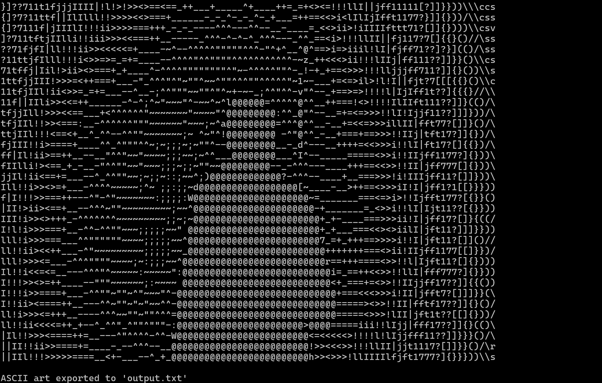
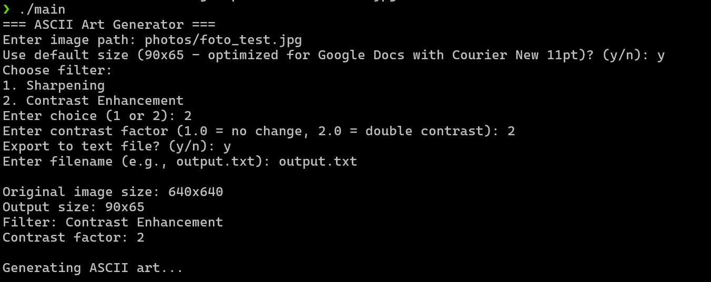
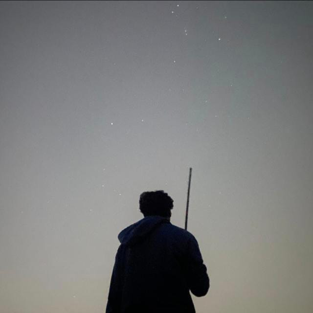

# ASCII Art from Image 
## C++ Project  

### About
This project converts images into ASCII art with customizable parameters. You can control the final output size and apply different image filters to enhance the quality of the ASCII art.

The project includes two types of filters:
1. **Sharpening Filter**: A matrix-based convolution filter that enhances edges in the image, making them appear bolder in the final ASCII art
2. **Contrast Enhancement**: Allows users to increase the contrast in the image for clearer differentiation between foreground and background elements

### Features
- **Image Processing**: Loads images in grayscale using STB Image library
- **Multiple Filters**: Choose between sharpening or contrast enhancement
- **Customizable Output Size**: Set width and height for the ASCII output
- **Export Options**: Display in terminal and/or save to text file
- **Optimized Defaults**: Default size (90x65) optimized for Google Docs with Courier New 11pt font
- **User-Friendly CLI**: Interactive text-based interface for easy configuration

### Examples

**ASCII Art Output:**


**CLI Interface:**


**Source Image:**



### How to Run
**Prerequisites:**
- C++ compiler (g++)
- Make utility
- STB Image header file (`stb_image.h`)

**Compilation and Execution:**
```bash
make
./char
```

**Usage:**
1. Enter the path to your image file
2. Choose to use default size (90x65) or set custom dimensions
3. Select filter type (sharpening or contrast enhancement)
4. Optionally export to a text file
5. View your ASCII art in the terminal!

### Technical Details
- **Image Loading**: Uses STB Image library for reading various image formats (JPEG, PNG, BMP, etc.)
- **Character Mapping**: Maps 256 grayscale intensity levels to 70 ASCII characters
- **Resizing Algorithm**: Nearest neighbor interpolation for image scaling
- **Filter Implementation**: 3x3 convolution kernel for sharpening, mathematical transformation for contrast

### File Structure
```
├── Makefile
├── main.cpp
├── stb_image.h
├── photos/
│   └── (your image files)
└── README.md
```


